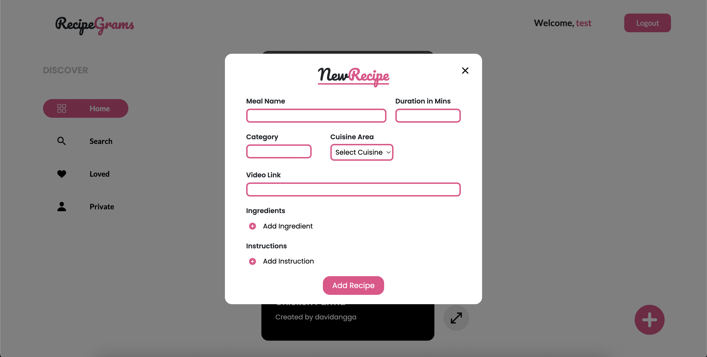

# Recipegrams
## About The Project
Like many other social media, RecipeGram revolve around sharing food and beverages recipes. 
Features:
* Creating and update recipe with embeded video media (for now the website can't upload video media so it uses youtube link)
* Search and explore various recipes shared by other users
* Like and archieved recipes
* Login and signup account

LIVE DEMO (A bit slow to load due to free tier server):[LINK](https://davidangga.github.io/recipegrams/) 

For credentials (Don't use real email):
test@gmail.com | test123!
## Built With
* [![Vue.js][Vue.js]][Vue-url]
* [![Express.js][Express.js]][Express-url]
* [![Node.js][Node.js]][Node-url]
* [![MongoDB][Mongodb]][Mongodb-url]
* [![JWT][JWT]][JWT-url]

## Installation
1. Clone the repo
```sh
git clone [clone url]
```
3. Project setup install dependencies for client and server folder
```sh
cd client
npm install
cd ../server
npm install
```
4. On the server folder, make a config folder with database.js file.
```js
module.exports = {
    development: {
      URL: [mongoDB_url],
      options: {
        useNewUrlParser: true,
        useUnifiedTopology: true
      }
    }
}
```
6. On app.js update the allow origins to frontend or client URL
```js
const allowedOrigins = [URL]; // Update with your frontend URL
```
8. Make .env file containing access and refresh secret token
```env
ACCESS_TOKEN_SECRET = TOKEN
REFRESH_TOKEN_SECRET = TOKEN
```
10. On client folder, under src look for API folder and change the baseURL
```js
baseURL: 'server's API URL', // Set your API base URL
```
11. run both client and server sides
```sh
npm run serve
```

## Usage and App ScreenShots
### Login and Sign Up

### Home Page

### Recipe's detail

### Create recipe

### Edit recipe

## License

Distributed under the MIT License. See `LICENSE.txt` for more information.

<!-- MARKDOWN LINKS & IMAGES -->
[Vue.js]: https://img.shields.io/badge/Vue.js-35495E?style=for-the-badge&logo=vuedotjs&logoColor=4FC08D
[Vue-url]: https://vuejs.org/
[Express.js]: https://img.shields.io/badge/Express.js-404D59?style=for-the-badge
[Express-url]: https://expressjs.com/
[Node.js]: https://img.shields.io/badge/Node.js-43853D?style=for-the-badge&logo=node.js&logoColor=white
[Node-url]: https://nodejs.org/en
[Mongodb]: 	https://img.shields.io/badge/MongoDB-4EA94B?style=for-the-badge&logo=mongodb&logoColor=white
[Mongodb-url]: https://www.mongodb.com/
[JWT]: https://img.shields.io/badge/json%20web%20tokens-323330?style=for-the-badge&logo=json-web-tokens&logoColor=pink
[JWT-url]: https://jwt.io/
